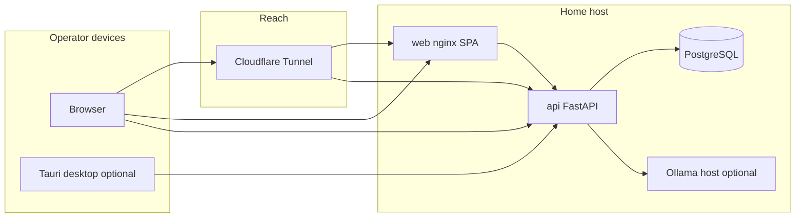
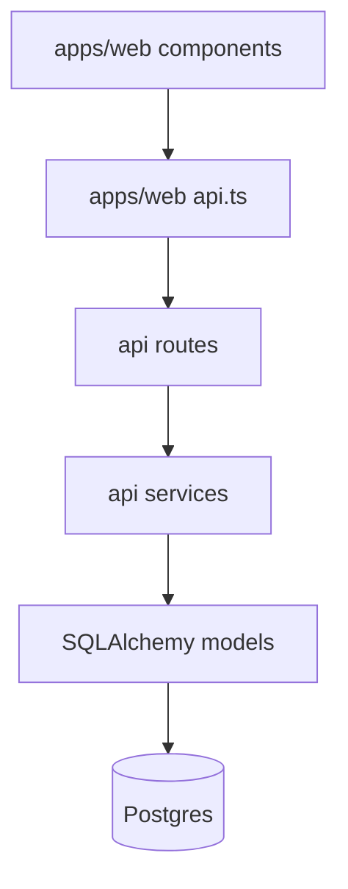
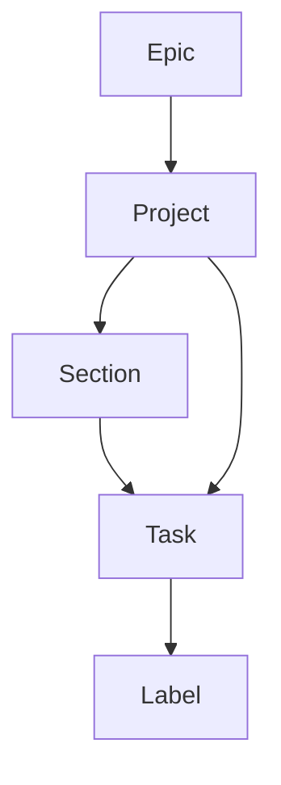
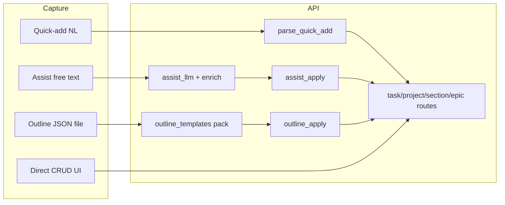

# Technical Architecture (living)

**Status:** Catch-up draft — 2026-08-14  
**Purpose:** One place to hang “how thePlan is put together *now*” after organic growth from a small planner. Product behavior stays in [02-functional-spec.md](./02-functional-spec.md); decisions stay in [adr/](./adr/); this doc is the **system map**.

**Update when:** topology, major pipelines, or layering rules change. Track gaps as [DEF-012](./DEFECTS.md#def-012--living-technical-architecture--diagrams-catch-up). Pair deep cleanup with [DEF-011](./DEFECTS.md#def-011--refactor-assessment-modularize--de-mix-layers).

---

## 1. One-liner

Personal **local-first** planner: **Vite/React** SPA → **FastAPI** → **PostgreSQL**, usually via **Docker Compose**, often reached remotely through **Cloudflare Tunnel**, with optional **Tauri** desktop shell and **Ollama** for Assist. Domain logic belongs in the API; the web UI is a thin client.

---

## 2. Runtime topology

Daily driver is **your** Postgres + API (+ web), not a multi-tenant SaaS. Cloud is used for *reach* (Tunnel) and *tools* (AI assist host, package registries)—not as the landlord of task data ([ADR-003](./adr/ADR-003-local-first-auth.md), [CLOUDFLARE-TUNNEL.md](./CLOUDFLARE-TUNNEL.md)).



| Piece | Role | Notes |
|-------|------|--------|
| `web` | Static SPA (nginx in Compose) | Same-origin or `VITE_API_URL`; cookies/session to API |
| `api` | FastAPI `/api/v1/*` | Migrations, auth, CRUD, Assist, Outline, calendars, schedule |
| `postgres` | Source of truth | Volume on host; backup is operator responsibility |
| Tunnel | Remote HTTPS | e.g. `plan.silverhelmet.com` → local Compose |
| Ollama | Assist model host | Native Windows often; Compose API uses `host.docker.internal:11434` |
| Tauri | Desktop prove-it | Sidecar API on loopback; packaging V.Later ([ADR-009](./adr/ADR-009-tauri-desktop.md)) |

Compose entry: [infra/compose/compose.yaml](../infra/compose/compose.yaml).

---

## 3. Repository layout

```text
apps/api/          FastAPI app, Alembic, pytest
apps/web/          Vite + React + TypeScript SPA
apps/desktop/      Tauri 2 prove-it shell
infra/compose/     Docker Compose
docs/              Vision, specs, ADRs, ops notes, this map
testdata/outlines/ Outline JSON fixtures (Theme F)
```

Neutral code identifiers (`apps/api`, not branded package names). Product name of record: **thePlan**.

---

## 4. Layering (where logic should live)



| Layer | Responsibility | Anti-pattern |
|-------|----------------|--------------|
| **Web UI** | Presentation, review/edit before apply, optimistic UX | Re-implementing ownership, scheduling math, or outline mapping |
| **`api.ts`** | HTTP + DTO shapes | Business rules |
| **Routes** | Auth dependency, validate request/response schemas, status codes | Fat domain workflows |
| **Services** | Domain workflows (Assist enrich/apply, outline propose/apply, schedule, calendar sync) | Reaching into React |
| **Models / Alembic** | Persistence | Feature policy |

ADR-001 consequence: **domain logic lives exclusively in the API**. Rapid Theme F / Assist growth may have strained that in places—see DEF-011.

---

## 5. Domain hierarchy (mental model)



- **Inbox:** tasks with `project_id IS NULL`.
- **Nesting:** task → subtask → nested subtask (max depth 2).
- **Outline mapping (Theme F):** certificate → Epic; course → Project; module → Section; item → Task + `task_type` labels ([ADR-011](./adr/ADR-011-templates-outline-ingest.md), [OUTLINE-INGEST.md](./OUTLINE-INGEST.md)).

Details: [04-data-schema.md](./04-data-schema.md), [02-functional-spec.md](./02-functional-spec.md) §1.

---

## 6. Major write pipelines

Three ways work enters the system. All **mutating** Assist/Outline paths are **propose → human review → apply** (no silent bulk write from a model).



| Pipeline | Propose | Apply | LLM? |
|----------|---------|-------|------|
| **Quick-add** | Client parse preview via `/quick-add/parse` | Client `POST /tasks` | No |
| **Assist** | `/assist/propose` (Ollama; enrich from `parse_quick_add`) | `/assist/apply` (`create_task` only today) | Yes (soft-fail if down) |
| **Outline** | `/outlines/propose` (deterministic pack) | `/outlines/apply` (epic/project/section/task) | No |
| **CRUD** | n/a | Direct REST | No |

**Scheduler:** CRUD and Assist/Outline must **never block** on Update Schedule / placement ([ADR-005](./adr/ADR-005-scheduler-decoupling.md)). Operator runs schedule when they want a layout.

**Calendars:** Google (W2a) and Microsoft (W3) sync are separate workers/routes; busy/mirror rules in their ADRs—not mixed into task CRUD.

---

## 7. Auth & tenancy

- Local accounts + session cookies; household admin patterns per W1.5 / ADR-007.
- **Single-user personal product** tenancy model ([ADR-002](./adr/ADR-002-single-user.md)) with multi-account household capability for family use—not a public multi-tenant SaaS.
- Ownership checks on every mutating path (`owner_id`).

---

## 8. Frontend map (hang details here)

| Area | Primary homes |
|------|----------------|
| Shell / nav | `App.tsx`, `Sidebar.tsx` |
| Task list / section grouping | `TaskList.tsx` (project + epic grouping) |
| Task detail (right panel) | `TaskDetailPanel.tsx` — fixed width today; resize = [DEF-008](./DEFECTS.md) |
| Quick-add | `QuickAdd.tsx` |
| Assist | `AssistPanel.tsx` |
| Outline import | `OutlineImportPanel.tsx` |
| Calendar | `CalendarView.tsx` |
| Settings | `SettingsPanel.tsx` |
| HTTP DTOs | `api.ts` |

---

## 9. Backend map

| Area | Primary homes |
|------|----------------|
| App wiring | `apps/api/app/main.py` |
| Routes | `apps/api/app/api/routes/*.py` |
| Assist | `services/assist_llm.py`, `assist_apply.py` |
| Outline | `services/outline_templates.py`, `outline_apply.py` |
| Quick-add NL | `services/quick_add.py` |
| Schedule / fuzzy | schedule services + [ADR-006](./adr/ADR-006-fuzzy-scheduling.md) |
| Models | `apps/api/app/models/` |
| Schemas | `apps/api/app/schemas/` |

---

## 10. Docs map (what to open for what)

| Need | Doc |
|------|-----|
| Why / non-goals | [01-product-vision.md](./01-product-vision.md) |
| Observable behavior | [02-functional-spec.md](./02-functional-spec.md) |
| Feature ↔ wave | [03-feature-catalog.md](./03-feature-catalog.md), [07-wave-roadmap.md](./07-wave-roadmap.md) |
| Tables | [04-data-schema.md](./04-data-schema.md) |
| REST | [05-api-contract.md](./05-api-contract.md) |
| Decisions | [adr/](./adr/) |
| Ops | [USER-GUIDE.md](./USER-GUIDE.md), [CLOUDFLARE-TUNNEL.md](./CLOUDFLARE-TUNNEL.md), [SLM-ASSIST.md](./SLM-ASSIST.md), [OUTLINE-INGEST.md](./OUTLINE-INGEST.md), [DESKTOP.md](./DESKTOP.md) |
| Open polish | [DEFECTS.md](./DEFECTS.md) |

---

## 11. Known gaps (honest)

- Functional spec / feature catalog still carry some **pre–Theme F** wording; trust ADRs + this map + DEFECTS for newest surfaces until a doc sync pass.
- API contract may lag Outline endpoints slightly—OpenAPI from the running API is authoritative for exact shapes.
- No claim that every service boundary is clean (DEF-011).
- This file will grow: calendar sync sequence diagrams, auth sequence, Update Schedule pipeline detail, etc.

---

## Related

- [DEF-012](./DEFECTS.md#def-012--living-technical-architecture--diagrams-catch-up) — keep this map current  
- [DEF-011](./DEFECTS.md#def-011--refactor-assessment-modularize--de-mix-layers) — modularize assessment  
- [ADR-001](./adr/ADR-001-tech-stack.md) · [ADR-010](./adr/ADR-010-slm-assist.md) · [ADR-011](./adr/ADR-011-templates-outline-ingest.md)
